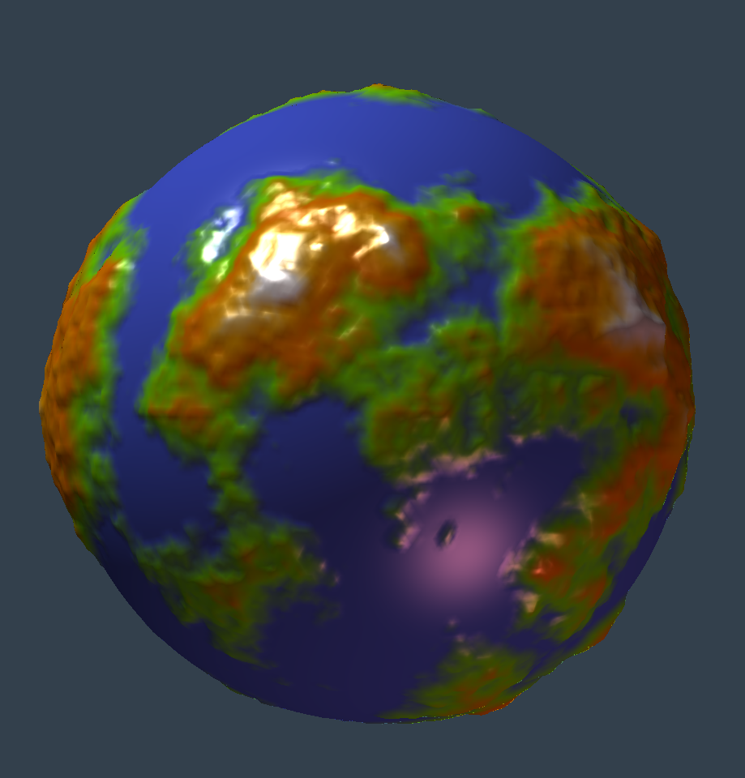

$$
   \newcommand{\cv}{\mathbf{v}}
$$

Written March 22, 2023.

# Procedural generation of planetoids.

On this page, I explain how to use a procedural generation algorithm to create an indexed mesh that resembles a planet or _planetoid_. I start from a (high resolution) unit radius sphere and then I radially displace the vertexes using Perlin Noise. An example mesh (for a particular set of parameter values) is seen here:

This generation algorithm has been tested in C++ but can be adapted to other programming languages, running from scratch or on any game engine.

## 1. High-resolution sphere.

The generation algorithm must use a high-resolution sphere, as we want to add high-resolution variations to enhance realism. Generating a high-resolution sphere can be easily done by using the usual parametrization of the sphere, based on longitude and latitude angles (that is, by rotating a semi-circumference going from the south to the north pole). However, this method produces triangles with a high variation in area and proportions, as it yields very small triangles near the poles and quite big ones near the equator. 

### 1.1. Icosahedron.

To solve this, we use a regular polyhedron (more concretely a platonic solid [[1]](#1)), whose vertexes are in the unit radius sphere, and which includes just equilateral triangles, all of them congruent (same area and edges length). Of all the platonic solids meeting this requirement, I choose the _Regular Icosahedron_ [[2]](#2), because this is the platonic solid with the largest number of triangles (20), and the smaller the original polyhedron triangles, the smaller triangle area variation we get in the final high-resolution mesh.

Regular icosahedron 12 vertexes can be generated by producing:

* A _north pole_ vertex at coordinates $$(0,1,0)$$ (index $$0$$ vertex)
* A _south pole_ vertex at coordinates $$(0,-1,0)$$ (index $$1$$ vertex)
* Five _upper ring_ vertexes, forming a regular pentagon at latitude $$+\arctan(1/2)$$ (indexes $$2$$ to $$6$$)
* Five _lower ring_ vertexes, forming a regular pentagon at latitude $$-\arctan(1/2)$$ (indexes $$7$$ to $$11$$)

### 1.2. Triangles subdivisions.

Once the Icosahedron has been generated, I split each original triangle into 4 triangles, which replace the original one. Thus I obtain an 80 triangles mesh. This process can be repeated $$n$$ times, each time subdividing every triangle in the mesh, so in the end we get an indexed mesh with exactly $$20\cdot 4^n$$ triangles. 

To subdivide a triangle into four, three new vertexes are added to the mesh vertex table, each one is placed in the middle of each edge of the original triangle. The three original vertexes, along with the three new ones, are used as vertexes for the new 4 triangles, which are also equilateral. These new triangles are added to the triangles table, while the original triangle is removed from that table.

This process leads to a mesh with the shape of an Icosahedron, made of small triangles, all of them with equal area. Each triangle is on one of the original Icosahdreon faces planes. As we want to obtain a sphere, we must modify the position of the new vertexes during the subdivision step: when a new vertex is computed (in the middle point of an edge), it is normalized before adding it to the vertexes table, that is, we displace the new vertex radially so it meets the unit-radius sphere surface. This normalization implies that the new four triangles are not the same area, but the area differences are very small as compared to the area difference you obtain with the latitude-longitude sphere generation algorithm. This can be verified visually, as you can assess by observing the final high-resolution sphere mesh.

## 2. Vertex displacement.

After computing the sphere, we need to modify the vertexes' positions to give it a characteristical _bumpy_ look. The natural option for this is to apply a radial displacement to each vertex, that is, to use a scalar factor $$f_i$$ to modify the distance from the origin to the $$i$$-th vertex. This yields a mesh resembling a planet whose height is different at each point, where _height_ here means the _distance__ to the_ planet's center_. If we name $$\cv_i$$ to the original position of the vertex and $$\cv_i'$$ the displaced position, we will compute the latter from the former as:

$$
     \cv_i' ~=~ f_i\, \cv_i
$$ 

Here, we assume we are using a cartesian coordinate frame whose origin is in the planet-center

## References.

<a id="1">[1]</a> 
_Platonic Solid_ in _Wikipedia: The Free Encyclopedia_, available from [https://en.wikipedia.org/wiki/Platonic_solid](https://en.wikipedia.org/wiki/Platonic_solid), retrieved March 22, 2023.

<a id="2">[2]</a> 
_Regular Icosahedron_ in _Wikipedia: The Free Encyclopedia_, available from [https://en.wikipedia.org/wiki/Regular_icosahedron](https://en.wikipedia.org/wiki/Regular_icosahedron), retrieved March 22, 2023.