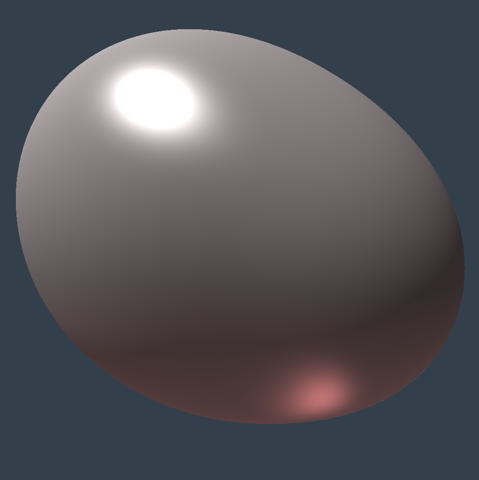
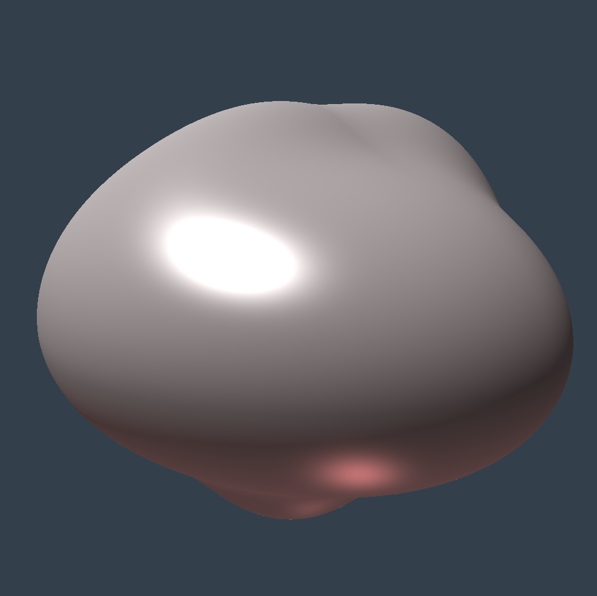
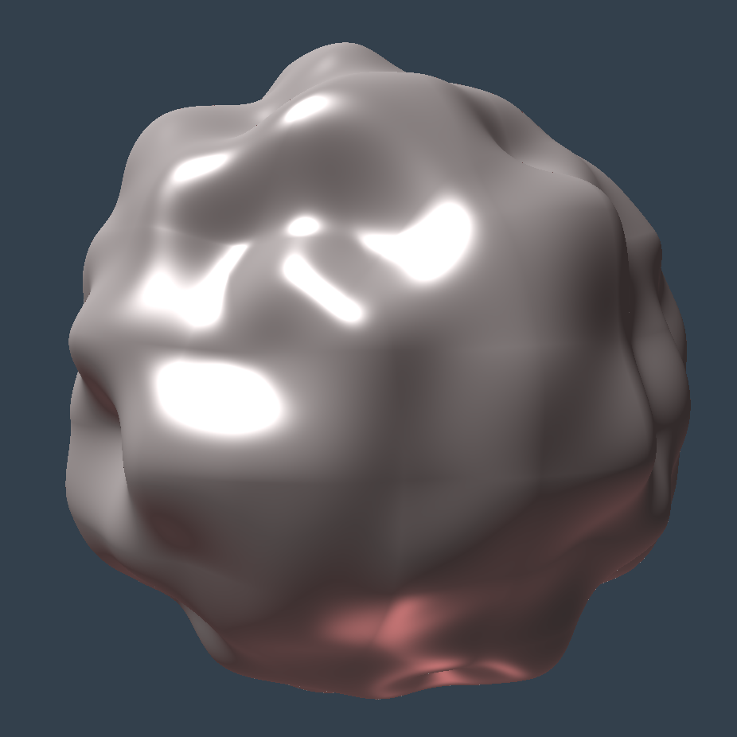
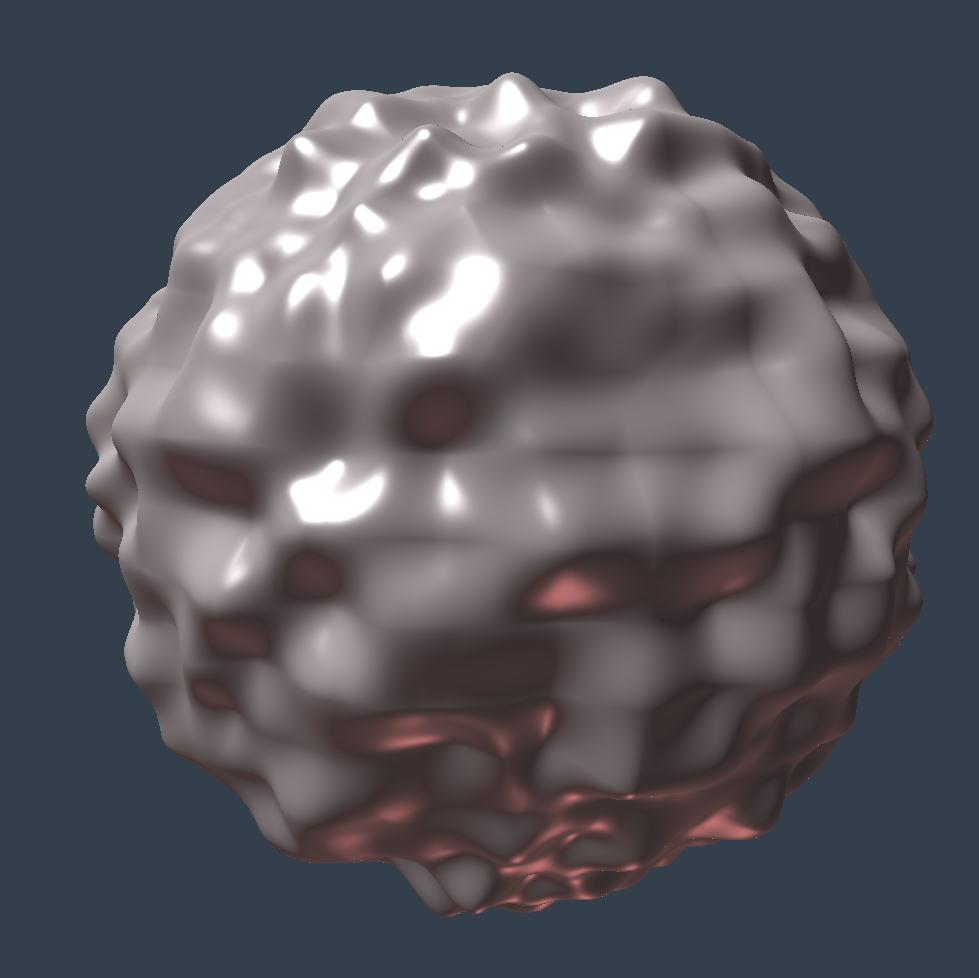
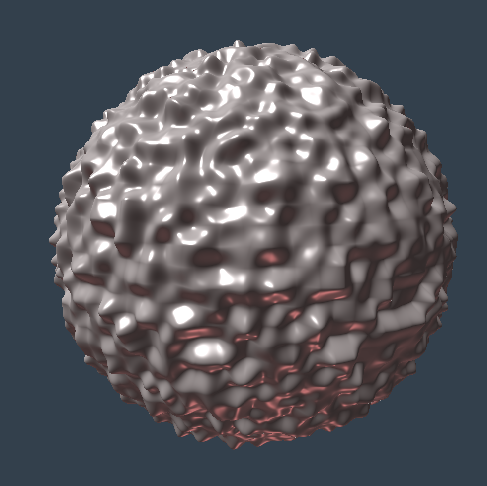
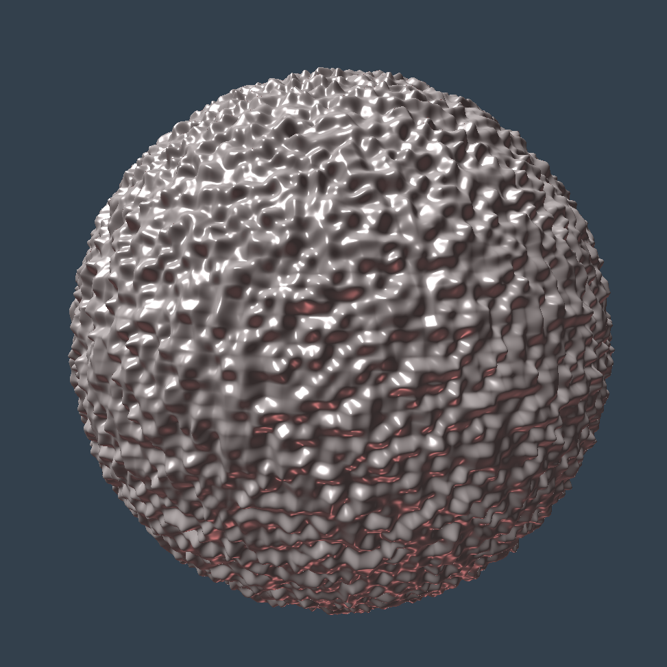
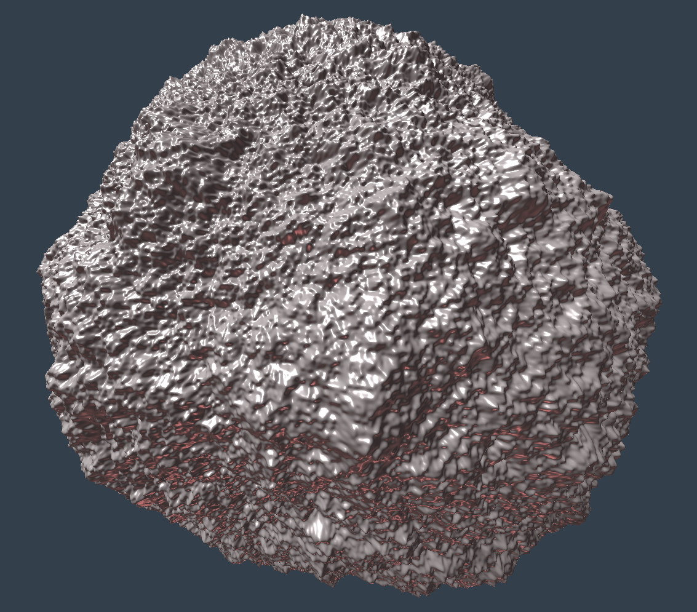

<script src="https://cdn.mathjax.org/mathjax/latest/MathJax.js?config=TeX-AMS-MML_HTMLorMML" type="text/javascript"></script>

$$
   \newcommand{\cv}{\mathbf{v}}
   \newcommand{\cp}{\mathbf{p}}
$$

Written March 22-27, 2023. **WORK IN PROGRESS**.

# Procedural generation of planetoids.

On this page, I explain how to use a procedural generation algorithm to create an indexed mesh that resembles a planet or _planetoid_. I start from a (high resolution) unit radius sphere and then I radially displace the vertexes using 3D Perlin Noise. This work is based on several papers and documents by Ken Perlin [[3]](#3) and Paul Bourke [[4]](#4).  An example mesh (for a particular set of parameter values) is seen here:

<center>

</center>

This generation algorithm has been tested in C++ but can be adapted to other programming languages, running from scratch or on any game engine.

## 1. High-resolution sphere.

The generation algorithm must use a high-resolution sphere, as we want to add high-resolution variations to enhance realism. Generating a high-resolution sphere can be easily done by using the usual parametrization of the sphere, based on longitude and latitude angles (that is, by rotating a semi-circumference going from the south to the north pole). However, this method produces triangles with a high variation in area and proportions, as it yields very small triangles near the poles and quite big ones near the equator. 

To solve this, we use a regular polyhedron (more concretely a platonic solid [[1]](#1), whose vertexes are in the unit radius sphere, and which includes just equilateral triangles, all of them congruent (same area and edges length). Of all the platonic solids meeting this requirement, I choose the _Regular Icosahedron_ [[2]](#2), because this is the platonic solid with the largest number of triangles (20), and the smaller the original polyhedron triangles, the smaller triangle area variation we get in the final high-resolution mesh.

After the icosahedron is generated, its triangles are iteratively subdivided, until a target resolution is reached. I detail both the icosahedron generation and the subdivision process below.

### 1.1. Icosahedron generation.

Regular icosahedron 12 vertexes can be generated by considering their spherical coordinates as detailed in [[2]](#2). Thus, we can enumerate the vertexes as follows:

* A _south pole_ vertex at coordinates $$(0,-1,0)$$ (index $$0$$ vertex)
* A _north pole_ vertex at coordinates $$(0,1,0)$$ (index $$1$$ vertex)
* Five _lower ring_ vertexes, forming a regular pentagon at latitude $$\beta\,=\,-\arctan(1/2)$$ (indexes $$2$$ to $$6$$). Thus, the $$y$$ coordinate for all these vertexes is $$y\,=\,\sin\beta\,=\,-1/\sqrt{5}$$. The longitude angle is $$2\pi\,i/5$$, with $$i$$ ranging from $$0$$ to $$4$$. The radius of the pentagon is $$-2y$$
* Five _upper ring_ vertexes, forming a regular pentagon at latitude $$+\arctan(1/2)$$ (indexes $$7$$ to $$11$$). The longitude angles are shifted so each upper ring vertex is between two lower ring vertexes. Thus, they can be generated by using longitude angles $$2\pi\,(i+1/2)/5$$, for each $$i$$ from $$0$$ to $$4$$. The $$y$$ coordinate is now $$1/\sqrt{5}$$, and the radius $$2y$$.

The C++ code to generate the vertex table (a `std::vector` of 3-float tuples, named `vertices`) is this:

```cpp 
const float h = 1.0f/sqrt(5.0f),  // y coordinate for south and north rings.
            r = 2.0f*h ;          // radius to Y axis for south and north rings

// south pole and north pole
vertices.push_back({ 0.0f, -1.0f, 0.0f }); // south --> 0
vertices.push_back({ 0.0f, +1.0f, 0.0f }); // north --> 1

// add lower (south) ring of vertexes
for( unsigned i = 0 ; i < 5 ; i++ )
{
   const float a = (float(i)*2.0f*M_PI)/5.0f ;
   vertices.push_back({ r*cosf(a), -h, r*sinf(a) });
}
// add upper (north) ring of vertexes
for( unsigned i = 0 ; i < 5 ; i++ )
{
   const float a = ((float(i)+0.5f)*2.0f*M_PI)/5.0f ;
   vertices.push_back({ r*cosf(a), +h, r*sinf(a) });
}
```

The triangles table (a `std::vector`of 3-unsigned tuples, named `triangles`) can be generated by producing 5 triangles adjacent to the south pole and lower ring vertexes, 10 triangles adjacent to both rings and finally 5 triangles adjacent to the upper ring and north pole. 

```cpp 
// triangles adjacent to south pole (vertex 0)
for( unsigned i = 0 ; i < 5 ; i++ )
   triangles.push_back({ 0, 2+i, 2+((i+1)%5)  });

// triangles between south and north rings 
for( unsigned i = 0 ; i < 5 ; i++ )
{
   const unsigned 
      n0 = 7+i, n1 = 7+(i+1)%5, 
      s0 = 2+i, s1 = 2+(i+1)%5 ;

   triangles.push_back({ s0, n0, s1 });
   triangles.push_back({ n0, n1, s1 });
}

// triangles adjacent to north pole (vertex 1)
for( unsigned i = 0 ; i < 5 ; i++ )
   triangles.push_back({ 1, 7+((i+1)%5), 7+i });
```

Here is a view of the icosahedron:

<center>

</center>


### 1.2. Triangles subdivisions.

Once the Icosahedron has been generated, I split each original triangle into 4 triangles, which replace the original one. Thus I obtain an 80 triangles mesh. This process can be repeated $$n$$ times, each time subdividing every triangle in the mesh, so in the end we get an indexed mesh with exactly $$20\cdot 4^n$$ triangles. 

To subdivide any given triangle into four, three new vertexes are added to the mesh vertex table, each one is placed in the middle of each edge of the original triangle. The three original vertexes, along with the three new ones, are used as vertexes for the new 4 triangles, which are also equilateral. These new triangles are added to the triangles table, while the original triangle is removed from that table.

As every input triangle is processed during the subdivisión process, any edge $$e$$ in the mesh can be visited one or two times during this process (as any edge can be adjacent to one or two triangles). Any edge must be split in two when it is first visited during the subdivision process. On the second visit (when it happens), the already created middle vertex must be retrieved. To achieve this efficiently a dictionary or map (a `std::map` instance) can be used. The map includes, for each visited edge (as a key), its corresponding middle vertex index (a third unsigned value). An edge is represented as a pair (a `std::pair` instance)  with two different unsigned values, the first being smaller than the second, to avoid redundancy. When any edge is visited, the map is queried to guess if it already contains that edge as a key or not. Then the corresponding middle vertex index is either retrieved or inserted in the map.

Below you can see the C++ code for the new vertices insertions in the subdivision step. It uses the map `em`, and uses an input table named `input_triangles` while adding vertexes to the table named `vertices`:

```cpp 

typedef std::pair< unsigned, unsigned > edge ; // datatype for edges (a pair of unsigned values)
std::map< edge, unsigned > em ; // edges map, for each edge, includes its new index.

for( auto t : input_triangles )
   for( unsigned i = 0 ; i < 3 ; i++ )
   {
      const edge     e   = { min( t[i], t[(i+1)%3]), max( t[i], t[(i+1)%3]) } ;
      const auto     f   = em.find(e);
      const unsigned ivm = (f == em.end()) ? vertices.size() : em[e] ;

      if ( ivm == vertices.size() ) // if the new vertex has not been created, create it:
      {  
         auto vm = 0.5f*(vertices[e.first]+vertices[e.second]) ;
         vertices.push_back( vm );
         em[e] = ivm ;
      }
   }
```

After new vertexes are added to the vertices table, we can insert new triangles in a the new triangles table (`output_triangles`), as follows:

```cpp 
output_triangles.resize( 4*(input_triangles->size()) );
unsigned long indt = 0 ;

for( auto t : input_triangles )
{
   // retrieve (in 'n') the indexes for the 3 new vertexes adjacent to triangle 't':
   const unsigned n[3] = 
   {  em[{ min(t[0],t[1]), max(t[0],t[1]) }], 
      em[{ min(t[1],t[2]), max(t[1],t[2]) }], 
      em[{ min(t[2],t[0]), max(t[2],t[0]) }] 
   };

   // create the four new triangles, using t's original vertexes and the new vertexes indexes
   output_triangles[indt++] = { t[0], n[0], n[2] };
   output_triangles[indt++] = { t[1], n[1], n[0] };
   output_triangles[indt++] = { t[2], n[2], n[1] };
   output_triangles[indt++] = { n[0], n[1], n[2] };
}
```

For an iterative version of this code, the input and output roles of these tables can be swapped after each step except the last one (this is usually called a _ping pong_ iterative algorithm).

Here is a view of a sequence of sub-divided icosahedrons with increasing resolution (that is, after 1,2,3 and 4 subdivision steps):

<center>
&nbsp;&nbsp;&nbsp;
</center>

This process leads to a mesh with the shape of an Icosahedron, made of small triangles, all of them with equal area. Each triangle is on one of the original Icosahdreon faces planes. As we want to obtain a sphere, we must modify the position of the new vertexes during the subdivision step: when a new vertex is computed (in the middle point of an edge), it is normalized before adding it to the vertexes table, that is, we displace the new vertex radially so it meets the unit-radius sphere surface. This normalization implies that the new four triangles are not the same area, but the area differences are very small as compared to the area difference you obtain with the latitude-longitude sphere generation algorithm. This can be verified visually, as you can assess by observing the final high-resolution sphere mesh.

Again, we see here a sequence of sub-divided icosahedrons, now with all the vertexes on the sphere:

<center>


</center>

## 2. Vertex displacement.

After computing the sphere, we need to modify the vertexes' positions to give it a characteristical _bumpy_ look. The natural option for this is to apply a radial displacement to each vertex, that is, to use a scalar factor to modify the distance from the origin to the $$i$$-th vertex. This yields a mesh resembling a planet whose height is different at each point, where _height_ here means the _distance__ to the_ planet's center_. 

The height or radius for each vertex is computed by using a _Perlin Noise_ function $$N$$. After that, the heights are normalized to a known range whose extreme values can be fixed by the programmer to tune the shape to its specific goals.  In this section, we cover the normalization step and the Perlin Noise function.

If we name $$\cv_i$$ to the original position of the vertex and $$\cv_i'$$ the displaced position, we will compute the latter from the former as:

$$
   \cv_i' ~=~ d_i\, \cv_i
$$ 

where $$d_i$$ is a scalar value (the new distance from the vertex to the origin). Here, we assume we are using a cartesian coordinate frame whose origin is in the planet center.

### 2.1. Normalization of Heights

The noise function $$N$$ (explained below) produces a scalar value $$N(\cp)$$ in $$[0,1]$$ for any point $$\cp$$ with coordinates in the range $$[-1\ldots+1]$$ (as the original sphere points have coordinates in that range). We use $$N$$ to compute a height value $$h_i=N(\cv_i)$$ for each vertex position $$\cv_i$$. After that, another scalar value $$d_i$$ is computed from $$h_i$$, so $$d_i$$ values are inside a known range, not necessarily equal to $$[0,1]$$, which can be fitted to specific planetoid characteristics.

This step is achieved by computing the minimal ($$m_0$$) and maximal ($$m_1$$) values of all $$h_i$$ values, and then computing a normalized value $$f_i$$ obviously as:

$$
   f_i ~=~ \frac{h_i - m_0}{m_1 - m_0}
$$

this way we ensure $$g_i$$ values cover the whole interval $$[0,1]$$. After this we can obtain each value $$d_i$$ by using two real parameters $$c$$ (the _base height_) and $$a$$ (the _heigh amplitude_):

$$
    d_i ~=~ c\,+\,a\cdot f_i
$$

This implies all the values $$d_i$$ lie in the interval $$[c,c+a]$$, including for sure at least two vertexes at the extreme values $$c$$ and $$c+a$$. These parameters can be fine-tuned to specific applications or looks.

This normalization code can be modified to optionally truncate the heigh values to a minimum value, for values below that minimum. I have used this to somehow resemble _seas_ in the planetoid (the blue zones in the first image above), as described in Paul Bourke paper _Frequency Synthesis of Landscapes_ [[4]](#4). If $$f_{min}$$ is the threshold value (with $$0<f_{min}<1$$), then $$d_i$$ is computed as:

$$
    d_i ~=~ c\,+\,a\cdot \mbox{max}\left( \,0\,;\, \frac{f_i-f_{min}}{1-f_{min}} \right)
$$

Note that no matter which version we use for $$d_i$$, it always lies in $$[c,c+a]$$. By setting $$f_{min}$$ to $$0$$, this formula becomes equivalent to the previous one, so no truncation is done.

The code below computes the array of $$h_i$$ values (`hv`), along with its minimal value $$m_0$$ (`hmin`) and the maximal one $$m_1$$ (`hmax`). It evaluates function $$N$$ by using `eval` method of the Perlin noise object `pn` (which is described below). Note that the vertex position coordinates are in the range $$[-1,+1]$$, while the noise function $$N$$ only receives coordinates in $$[0,1]$$, so the vertex coordinates are transformed to that range before evaluating $$N$$.

```cpp 
PerlinNoise3D  pn( p.num_levels ) ;
vector<float>  hv( vertices.size() );
float          hmin = 1.0, 
               hmax = 0.0 ;

for( unsigned iv = 0 ; iv < vertices.size() ; iv++  )
{
   const float h = pn.eval( (1.0f+vertices[iv](0))/2.0f, 
                            (1.0f+vertices[iv](1))/2.0f, 
                            (1.0f+vertices[iv](2))/2.0f );
   hv[iv] = h ;
   hmin = min( h, hmin );
   hmax = max( h, hmax );   
}
``` 

The following code computes $$f_i$$ and $$d_i$$ values, and displaces the vertexes radially, by using parameters $$a$$ (`p.d_base`) and $$b$$ (`p.d_scale`):

```cpp 
for( unsigned iv = 0 ; iv < vertices.size() ; iv++  )
{
   const float f = (hv[iv]-hmin)/(hmax-hmin) ;
   const float d = p.truncate_to_min_f 
                     ? ((f < p.min_f) ? 0.0f : (f-p.min_f)/(1.0-p.min_f) )
                     : f ;
   vertices[iv] = (p.d_base + p.d_scale*d) * vertices[iv] ;

   if ( p.add_vertex_colors )
   {  // optionally: set vertex color (see below)
      // .....
   }
}
``` 

The first image in this text shows a colored planetoid. This is achieved by computing an RGB color attribute for each vertex by using the normalized $$d_i$$ value of that vertex (that is, the color depends only on the height of the vertex). To do this, we use a _color ramp_ (a vector with $$n$$ colors), which defines a piecewise linear function from $$d_i$$ to RGB colors. 

The code below computes the color for vertex `iv` when `p.add_vertex_color` is true by using the `d` variable as defined in the code above, and the color ramp stored in `p.color_ramp`. We assume `colors` is a vector with RGB 3-float tuples, with the same size as the vertex table:

```cpp 
if ( p.add_vertex_colors )
{
   const unsigned ic_max = p.color_ramp.size()-1 ; // last color index
   const float    fnc    = d*float( ic_max ) ;
   const float    ic_f   = truncf( fnc );
   const unsigned ic     = unsigned( ic_f );
   const float    frac   = fnc - ic_f ;

   if ( ic < ic_max )
      colors[iv]  = p.color_ramp[ic]*(1.0f-frac) + p.color_ramp[ic+1]*frac ;
   else 
      colors[iv]  = p.color_ramp[ic_max] ;
}
``` 

### 2.2. Fractal 3D Perlin noise function.

The Perlin Noise function $$N$$ accepts a  coordinates tuple $$\cp=(x,y,z)$$ (with $$0\leq x,y,z \leq 1$$) and yields a scalar value (in $$[0,1]$$). The function is defined as a weighted sum of $$n>0$$ different noise function $$M_i$$, where $$n$$ is called the _number of levels_, as follows:

$$
     N(\cp)  ~=~   \frac{1}{s}\,\sum _{i=0}^{n-1} w_i\,M_i(2^i\cp)
     ~~~~~~~\mbox{where}~~~w_i = \frac{1}{2^i} ~~~~ s = \sum_{i=0}^{n-1} w_i
$$

This kind of noise function is called a _fractal_ or _multioctave_ solid noise function. Each term $$w_i M_i(2^i \cp)$$ is usually called an _octave_. It was first described in Ken Perlin's 1985 seminal paper [[3]](#3). The name _solid_ is used for 3D function (its argument is a 3D point instead of a 1d or 2d point). Our application demands 3D noise instead of 2D because the spherical planetoid surface cannot be uniformly covered with a 2D noise function. 

The term _fractal_ is used here because each successive octave is a scaled version of the previous one, so in theory, if we use an infinite number of octaves, the function would be self-similar under scalings, and this is exactly the property fractal shapes hold in general. 

Each $$M_i$$ function is a noise signal with random values (uniformly distributed in $$[0,1]$$) at points with integer coordinates, and whose values in non-integer coordinates are obtained by interpolation. Thus, it has no frequencies above the unit frequency (unit wavelength). Evaluation of the $$M_i$$ functions is discussed below in the next sub-section. The scaling for each successive $$i+1$$-th octave means that each one has double the frequency and half the amplitude than the previous $$i$$-th octave. By adding a finite number of these octaves, we get a noise signal with a range of frequencies that resembles natural formations (see [[3]](#3) and [[4]](#4)).

We use a slightly modified version of the above formula for $$M$$ because we do not add the firsts octaves, but we allow to start the summation from the $$m$$-th octave instead of $$0$$-th octave (with $$0<m<n-1$$). This leads to a more natural planetoid look, as those first octaves give it an elongated shape, far away from the spherical one we expect for a planetoid. I usually set $$m$$ to $$2$$. 

We also scale successive weights by using a positive real value $$b$$ (we call it _octaves amplitude scale factor_) not necessarily equal to $$2$$, as this gives more control over the final planetoid roughness. I usually set $$b$$ to $$1.8$$. So the actual formulation for $$N$$ we use is:

$$
     N(\cp)  ~=~   \frac{1}{s}\,\sum _{i=m}^{n-1} w_i\,M_i(2^i\cp)
     ~~~~~~~\mbox{where}~~~w_i = \frac{1}{b^i} ~~~~ s = \sum_{i=m}^{n-1} w_i
$$

Evaluation of $$N$$ function can be done by using the `eval` method of `PerlinNoise3D` class. The method repeatedly calls the `octave` method, which evaluates $$M_i$$. The number of octaves $$n$$ (`num_levels`) is a parameter given to the class constructor, as it is the octaves amplitude factor (`octaves_asf`) and the min level $$m$$ (`min_level`). The code is here:

```cpp 
float PerlinNoise3D::eval( const float px, const float py, const float pz ) 
{
   float sum_v = 0.0f, 
         sum_w = 0.0f, 
         w     = 1.0f,
         spx   = px, 
         spy   = py, 
         spz   = pz;

   for( unsigned i = 0 ; i < num_levels ; i++ )
   {
         if (  min_level <= i )
         {  
            sum_v += w * evalM( i, spx, spy, spz ); 
            sum_w += w ;
         }
         spx *= 2.0f ;
         spy *= 2.0f ;
         spz *= 2.0f ;
         w   /= octaves_asf ;
   }
   return sum_v / sum_w ;
}
``` 

In this set of images, we observe a sequence of 7 planetoids. Each one includes a single octave $$w_i M_i(2^i\cp)$$, for $$i$$ from $$0$$ to $$6$$:

<center>







</center>

And here is a mesh with all the first 7 octaves added:

<center>

</center>


### 2.2. The basic noise functions $$M_i$$.

Each function $$M_i$$ is a function (with real values $$[0,1]$$) that interpolates between random values associated with each 3D point with integer coordinates (which are usually called _lattice points_). 

The function $$M_i$$ expects coordinates in the range $$[0,2^i]$$. For any given lattice point $$\cp=(i_x,i_y,i_z)$$ with integer coordinates (with $$0\leq i_x,i_y,i_z\leq 2^i$$), the function $$M_i$$ yields a random value $$r_{i_x,i_y,i_z}$$. For any non-integer coordinates tuple $$(x,y,z)$$, function $$M_i$$  does interpolation by using the $$8$$ random values associated with the $$8$$ lattice points in the vertexes of the cube including $$(x,y,z)$$. 

To implement evaluations of $$M_i$$, we can use an array of $$2^{3i}$$ precomputed random values for each $$i$$ from $$0$$ to $$n-1$$. However, this requires a lot of memory even for not-so-large values of $$n$$, but in fact, only a small fraction of those values are going to be used. 

Thus, to save memory and time, we use a different _map_ or _dictionary_ for each $$i$$, which is populated on demand during the mesh construction process. Each dictionary stores lattice coordinates triples as keys and random reals as values. Each $$i$$-th map is initially empty. When a new random value at one lattice point is requested, the program checks if the integer coordinates are already present in the map as a key. If they are, the corresponding random value is retrieved and returned, if they are not, a new random value is inserted in the map and then returned. In the end, the map will include a number of random values that is proportional to the number of mesh vertexes (considering the worst case, in which each mesh vertex causes a disjoint set of lattice points to be queried). 

In C++ these maps can be implemented as an array of `std::map` instances, whose declaration (as instance variable of `PerlinNoise3D` class) is shown here, along with the random integers generator

```cpp 
// type for keys
typedef std::tuple< unsigned short, unsigned short, unsigned short > Triple ; 

// maps array (one for each Mi function)
std::vector< std::map< Triple, float >> mlmap ; 

// declarations needed to generate random values
constexpr unsigned maxrv = int(0xFFFFFF) ;   // max random value 
std::default_random_engine  generator{ (std::random_device())() };
std::uniform_int_distribution<unsigned> uniform_dist{ 0, maxrv } ;
```

To implement map queries I use the `queryMaps` method shown here:

```cpp 
float PerlinNoise3D::queryMaps( const unsigned level, const unsigned ix, const unsigned iy, const unsigned iz )
{
   const Triple  tr    = { ix, iy, iz } ; 
   const auto    found = mlmap[level].find( tr ) ;

   if ( found == mlmap[level].end() )
   {
      const float rval = float( uniform_dist( generator )) / float(maxrv) ;
      mlmap[level][tr] = rval ;
      return rval ;
   }
   else 
      return mlmap[level][tr] ;
}
```

Here the constant `maxrv` is the maximum integer value produced by the generator, that is `int(0xFFFFFF)`.

For any non-integer coordinates query points $$\cp=(x,y,z)$$, interpolation is carried out. This is done by considering the $$8$$ random values stored in the map for the vertexes of the cube which includes $$\cp$$. Once these values are known, 3D interpolation is achieved by repeated calls to a 1d interpolation function $$I(t,a,b)$$ which interpolates between $$a$$ and $$b$$. Assuming $$a\leq b$$ and $0\leq t\leq 1$$, function $$I$$ holds:

 * $$I$$ is non-decreasing.
 * $$I(0,a,b) ~=~a$$.
 * $$I(1,a,b) ~=~b$$.

The code of `evalM` method is shown below. It uses the 1D interpolation function `interpolate` (described next).

```cpp 
float PerlinNoise3D::evalM( const unsigned level, 
                            const float spx, const float spy, const float spz ) 
{
   const float // get integer and fractional parts of coordinates (as floats)
      ix_float = std::truncf( spx ),
      iy_float = std::truncf( spy ),
      iz_float = std::truncf( spz );
   const float 
      fx = spx - ix_float ,
      fy = spy - iy_float ,
      fz = spz - iz_float ;

   const unsigned  // get integer part as unsigned values
      ix = unsigned( ix_float ),
      iy = unsigned( iy_float ),
      iz = unsigned( iz_float );

   // get 8 values from the map (c000 ... c111 ) , and then interpolate
   const float 
      c000 = queryMaps( level, ix+0, iy+0, iz+0 ),
      c001 = queryMaps( level, ix+0, iy+0, iz+1 ),
      c010 = queryMaps( level, ix+0, iy+1, iz+0 ),
      c011 = queryMaps( level, ix+0, iy+1, iz+1 ),
      c100 = queryMaps( level, ix+1, iy+0, iz+0 ),
      c101 = queryMaps( level, ix+1, iy+0, iz+1 ),
      c110 = queryMaps( level, ix+1, iy+1, iz+0 ),
      c111 = queryMaps( level, ix+1, iy+1, iz+1 );
   const float 
      c00  = interpolate( fx, c000, c100 ),
      c01  = interpolate( fx, c001, c101 ),
      c10  = interpolate( fx, c010, c110 ),
      c11  = interpolate( fx, c011, c111 ),
      c0   = interpolate( fy, c00,  c10  ),
      c1   = interpolate( fy, c01,  c11  );

   return interpolate( fz, c0, c1 );
}
```

A simple linear 1D interpolation function could be used for $$I$$ (as described in [[5]](#5)) :

$$
      I(t,a,b) ~~=~~  (1-t)\,a \:+\: t\,b
$$

However, this linear 1D interpolation causes discontinuities in the surface slope, as the resulting surface is $$C^0$$ continuous, but not $$C^1$$.  These slope discontinuities can be visible as creases, especially for the lower octaves. 

Instead of linear 1D interpolation, several alternative functions have been proposed in the literature,  such as using _Cubic Hermite Splines_ [[6]](#6), which allow setting the derivative of $$I$$ at $$0$$ and $$1$$. In this application, however, good results can be achieved by using a cubic polynomial, but simply setting those derivatives to $$0$$. The resulting spline interpolation function is this:

$$
      I(t,a,b) ~~=~~  (1-f(t))\,a \:+\: f(t)\,b ~~~~~~~~~~~~~~~~~
      \mbox{where} ~~~~~~ f(t) ~=~ 2t^3\:-\,3t^2\:+\,1
$$

It is easy to check that this particular version of $$I$$ obeys the desired properties. We can also use any other functions $$f$$, as long as it is non-decreasing and it obeys: $$f(0)=0$$, $$f(1)=1$$, and $$f'(0)=f'(1)=0$$. Concretely, we can use the sine function:

$$
     f(t) ~~=~~ \frac{1}{2}\,\sin \left( \left(t-\frac{1}{2}\right)\pi\right)
$$

The code for the `interpolate` function is this:

```cpp
inline float interpolate( const float t, const float a, const float b )
{
   const float ft = 0.5f * (1.0f + std::sinf( (t-0.5f)*M_PI ));         
   return (1.0f-ft)*a + ft*b ;
}
```


**WORK IN PROGRESS**

## References.

<a id="1">[1]</a> 
_Platonic Solid_ in _Wikipedia: The Free Encyclopedia_, available from [https://en.wikipedia.org/wiki/Platonic_solid](https://en.wikipedia.org/wiki/Platonic_solid), retrieved March 22, 2023.

<a id="2">[2]</a> 
_Regular Icosahedron_ in _Wikipedia: The Free Encyclopedia_, available from [https://en.wikipedia.org/wiki/Regular_icosahedron](https://en.wikipedia.org/wiki/Regular_icosahedron), retrieved March 22, 2023.

<a id="3">[3]</a>
Ken Perlin: _An image synthesizer_ in SIGGRAPH 85: International Conference on Computer Graphics and Interactive Techniques (1985). PDF: [http://www.cs.cmu.edu/afs/cs.cmu.edu/academic/class/15869-f11/www/readings/perlin85_imagesynthesizer.pdf](http://www.cs.cmu.edu/afs/cs.cmu.edu/academic/class/15869-f11/www/readings/perlin85_imagesynthesizer.pdf)

<a id="4">[4]</a>
Paul Bourke: _Fractal Landscapes_ (1991), _Frequency Synthesis of Landscapes_ (1997), _Generating noise with different power spectra laws_ (1998), _Deterministic 1/f noise_ (1999), _Modelling fake planets_ (2000),  _Perlin Noise and Turbulence_ (2000).  Web:
<a href="http://paulbourke.net/fractals/noise/">http://paulbourke.net/fractals/noise/</a> retrieved  March 27, 2023.

<a id="5">[5]</a>
_Trilinear Interpolation_ in _Wikipedia: The Free Encyclopedia_, available from [https://en.wikipedia.org/wiki/Trilinear_interpolation](https://en.wikipedia.org/wiki/Trilinear_interpolation), retrieved March 27, 2023.

<a id="5">[6]</a>
_Cubic Hermite Spline_ in _Wikipedia: The Free Encyclopedia_, available from [https://en.wikipedia.org/wiki/Cubic_Hermite_spline](https://en.wikipedia.org/wiki/Cubic_Hermite_spline), retrieved March 27, 2023.
